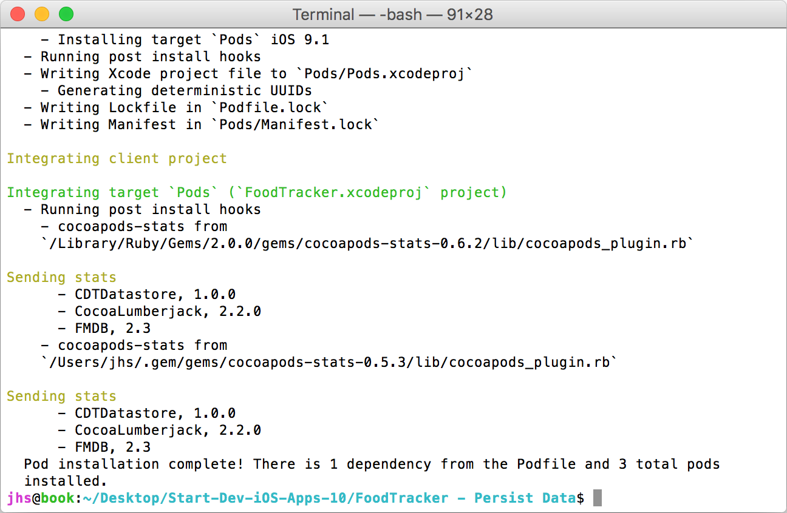

# Start Developing iOS Apps (Swift) - With Cloud Data Sync; Part 1: The Datastore

This walkthrough is a "sequel" to Apple's well-known iOS programming introduction, [Start Developing iOS Apps (Swift)][apple-doc]. Apple's introduction walks us through the process of building the UI, data, and logic of an example food tracker app, culiminating with a section on data persistence: storing the app data as files in the iOS device.

This series picks up where that document leaves off: syncing data between devices, through the cloud, with an offline-first design. You will achieve this using open source tools and the IBM Cloudant service.

This document is the first in the series, showing you how to use the Cloudant Sync datastore (CDTDatastore) for FoodTracker on the iOS device. Subsequent posts will cover syncing to the cloud and other advanced features such as accounts and data management.

## Table of Contents

1. [About the Lessons](#about-the-lessons)
1. [CocoaPods](#cocoapods)
  1. [Learning Objectives](#learning-objectives)
  1. [Install CocoaPods on your Mac](#install-cocoapods-on-your-mac)
  1. [Install Cloudant Sync using CocoaPods](#install-cloudant-sync-using-cocoapods)
  1. [Change from a Project to a Workspace](#change-from-a-project-to-a-workspace)
1. [Compile with Cloudant Sync](#compile-with-cloudant-sync)
  1. [Learning Objectives](#learning-objectives-1)
  1. [Create the CDTDatastore Bridging Header](#create-the-cdtdatastore-bridging-header)
  1. [Check the Build](#check-the-build)
1. [Store Data Locally with Cloudant Sync](#store-data-locally-with-cloudant-sync)
  1. [Learning Objectives](#learning-objectives-2)
  1. [The Cloudant Document Model](#the-cloudant-document-model)
  1. [Remove NSCoding](#remove-nscoding)
  1. [Initialize the Cloudant Sync Datastore](#initialize-the-cloudant-sync-datastore)
  1. [Deleting the Datastore in the iOS Simulator](#deleting-the-datastore-in-the-ios-simulator)
  1. [Implement Storing and Querying Meals](#implement-storing-and-querying-meals)
  1. [Create Sample Meals in the Datastore](#create-sample-meals-in-the-datastore)

## Getting Started

These lessons assume that you have completed the [FoodTracker app][apple-doc] from Apple's walkthrough. First, complete that walkthrough. It will teach you the process of beginning an iOS app and it will end with the chapter, [Persist Data][apple-doc-download]. Download the sample project from the final lesson (the "Download File" link at the bottom of the page).

Extract the zip file, `Start-Dev-iOS-Apps-10.zip`, browse into its folder with Finder, and double-click `FoodTracker.xcodeproj`. That will open the project in Xcode. Run the app (Command-R) and confirm that it works correctly. If everything is in order, proceed with these lessons.


## CocoaPods

The first step is to connect with the broader open source iOS software community by installing free software packages using [CocoaPods][cocoapods]. You will use the CocoaPods repository to integrate the [Cloudant Sync Datastore][cdtdatastore-pod] library, called **CDTDatastore**.

### Learning Objectives

At the end of the lesson, you’ll be able to:

  1. Install CocoaPods on your Mac
  1. Use CocoaPods to download and integrate CDTDatastore with FoodTracker

### Install CocoaPods on your Mac

The CocoaPods web site has an excellent page, [Getting Started][cocoapods-getting-started], which covers intalling and upgrading. For your purposes, you will use the most simple, using the command-line `gem` program.

**To install CocoaPods**

  1. Open the Terminal application
    1. Click the Spotlight icon (a magnifying glass) in the Mac OS taskbar
    1. Type "terminal" in the Spotlight prompt, and press return
  1. In Terminal, type this command:

  ```
  sudo gem install cocoapods
  ```

  1. Confirm that CocoaPods is installed with this command:

  ```
  pod --version
  ```

  You should see the CocoaPods version displayed in Terminal:

  ```
  0.39.0
  ```

### Install Cloudant Sync using CocoaPods

To install CDTDatastore as a dependency, create a *Podfile*, a simple configuration files which tell CocoaPods which packages this project needs.

**To create a Podfile**

  1. Choose File > New > File... (or press Command-N)
  1. On the left side of the dialog that appears, under "iOS", select Other.
  1. Select Empty, and click Next.
  1. In the Save As field, type `Podfile`.
  1. The save location ("Where") defaults to your project directory.

     The Group option defaults to your app name, FoodTracker.

     In the Targets section, make sure both your app and the tests for your app are not selected.
  1. Click Create.

     Xcode creates a file called `Podfile` which is open in the Xcode editor.

Next, configure CDTDatastore in the Podfile.

**To configure the Podfile**

  1. In `Podfile`, add the following code

     ``` ruby
     platform :ios, '9.1'
     pod "CDTDatastore", '~> 1.0.0'
     ```
  1. Choose File > Save (or press Command-S)

With your Podfile in place, you can now use CocoaPods to install the CDTDatastore pod.

**To install CDTDatastore**

  1. Open Terminal
  1. Change to your project directory, the directory containing your new Podfile. For example,

     ```
     # Your 'cd' command may be different; change to the folder you use.
     cd "FoodTracker - Persist Data"
     ```
  1. Type this command

     ```
     pod install --verbose
     ```

You will see colorful output from CocoaPods in the terminal.




### Change from a Project to a Workspace

Because you are now integrating FoodTracker with the third-party CDTDatastore library, your project is really a *group* of projects combined into one useful whole. XCode supports this, and CocoaPods has already prepared you for this transition by creating `FoodTracker.xcworkspace` for you&mdash;a *workspace* encompassing both FoodTracker and CDTDatastore.

**To change to your project workspace**

  1. Choose File > Close Window (or press Command-W)
  1. Choose File > Open (or press Command-O)
  1. Select `FoodTracker.xcworkspace` and click Open

You will see a similar XCode view as before, but notice that you now have two projects now.


*Checkpoint:* Run your app. The app should behave exactly as before. Now you know that everything is in its place and working correctly.

## Compile with Cloudant Sync

Your next step is to compile the Food Tracker along with CDTDatastore, the Cloudant Sync library. You will not change any major FoodTracker code yet; however, this will confirm that CDTDatastore and FoodTracker integrate and compile correctly.

**Note**, you may see compiler warnings from CDTDatastore code and its dependencies. These are normal. The warnings are not a problem.

### Learning Objectives

At the end of the lesson, you’ll be able to create a *bridging header* to link Swift and Objective-C code.

### Create the CDTDatastore Bridging Header

CDTDatastore is written in Objective-C. FoodTracker is a Swift project. Currently, the best way to integrate these projects together is with a [bridging header][bridging-header]. The bridging header, `CloudantSync-Bridging-Header.h` will tell Xcode to compile CDTDatastore into the final app.

**To create a header file**

  1. Choose File > New > File (or press Command-N)
  1. On the left side of the dialog that appears, under "iOS", select Source.
  1. Select Header File, and click Next.
  1. In the Save As field, type `CloudantSync-Bridging-Header`.
  1. Click the down-arrow expander button to the right of the "Save As" field. This will display the filesystem tree of the project.
  1. Click the FoodTracker folder.
  1. Confirm that the Group option defaults to your app name, FoodTracker.
  1. In the Targets section, check the FoodTracker target.
  1. Click Create.

     Xcode creates and opens a file called `CloudantSync-Bridging-Header.h`.
  1. Under the line which says `#define CloudantSync_Bridging_Header_h`, insert the following code:

     ``` c
     #import <CloudantSync.h>
     ```
  1. Choose File > Save (or press Command-S)

The header file contents are done. But, despite its name, this file is not yet a *bridging header* as far as Xcode knows. The final step is to tell Xcode that this file will serve as the Objective-C bridging header.

**To assign a project bridging header**

  1. Enter the Project Navigator view by clicking the upper-left folder icon (or press Command-1).
  1. Select the FoodTracker app in the Navigator.
  1. Under **Project**, select FoodTracker.
  1. Click "Build Settings"
  1. Click All to show all build settings
  1. In the search bar, type "bridging header." You should see **Swift Compiler - Code Generation** and inside it, **Objective-C Bridging Header**.

     
  1. Double-click the empty space in the "FoodTracker" column, in the row **Objective-C Bridging Header**.
  1. A prompt window will pop up. Input the following:

     ```
     FoodTracker/CloudantSync-Bridging-Header.h
     ```
     
  1. Press return

Your bridging header is done! Xcode should look like this:


### Check the Build

*Checkpoint:* Run your app. This will confirm that the code compiles and runs. While you have not changed any user-facing app code, you have begun the first step to Cloudant Sync by compiling CDTDatastore into your project.

## Store Data Locally with Cloudant Sync

With CDTDatastore compiled and connected to FoodTracker, the next step is to replace the NSCoder persistence system with CDTDatastore. Currently, in `MealTableViewController.swift`, during initialization, the encoded array of meals is loaded from local storage. When you add or change a meal, the entire `meals` array is encoded and stored on disk. You will replace that system with a document-based architecture&mdash;in other words, each meal will be one record (called a "document" or simply "doc") in the Cloudant Sync datastore.

Keep in mind, this first step of using Cloudant Sync *does not use the Internet at all*. The first goal is simply to store app data locally. After that works correctly, you will add cloud sync features. This is the *offline-first* architecture, with Internet access being *optional* to use the app. All data operations are on the local device. (If the device has an Internet connection, then the app will sync its data to the cloud&mdash;covered in future posts in this series.)

### Learning Objectives

At the end of the lesson, you’ll be able to:

  1. Understand the Cloudant document model:
    1. Key-value storage for simple data types
    1. Attachment storage for binary data
    1. The document ID and revision ID
  1. Store meals in the Cloudant Sync datastore
  1. Query for meals in chronological order, from the datastore

### The Cloudant Document Model

Let's begin with a discussion of Cloudant basics. The *document* is the primary data model of all IBM Cloudant databases, not only Cloudant Sync for iOS, but also for Android, the Cloudant hosted database, and even the open source [Apache CouchDB][couchdb] database.

A document, often called a *doc*, is a set of key-value data. Do not think, "Microsoft Office document"; think "JSON object." A document is a JSON object: keys (strings) can have values (Ints, Doubles, Bools, Strings, as well as nested Arrays and Dictionaries).

Documents can also contain binary blobs, called *attachments*. You can add, change, or remove attachments in a very similar way as you would add, change, or remove key-value data in a doc.

All documents always have two pieces of metadata, used to manage them. The *document ID* (sometimes called *_id* or simply *id*) is a unique string identifying the doc. You use the ID to read, and write a specific document.

The *revision ID* (sometimes called *_rev* or *revision*) is a string generated by the datastore which tracks when the doc changes. The revision is mostly used interally by the datastore, especially to facilitate replication. In practice, you need to remember a few simple things about revisions:

* The revision ID changes every time you update a document.
* When you update a document, you provide the current revision ID to the datastore, and the datastore will return to you the *new* revision ID of the new document.
* When you create a document, you *do not* provide a revision ID, since there is no "current" document with a "current" revision ID to provide.

Finally, note that deleting a document is actually an update, with metadata set to indicate deletion (sometimes called a document "tombstone"). Since a delete is an update just like any other, the deleted document will have its own revision ID. The tombstones are necessary for replication: replicating a tombstone from one database to another will cause both databases to reflect the deletion.

### The Design

With this in mind, consider: how will the sample meals work? At first, you might think to create meal documents when FoodTracker starts. That will work correctly the first time the user runs the app; however, if the user changes or deletes the sample meals, *those changes must persist*. For example, if the user deletes the sample meals and then restarts the app later, those meals must remain deleted.

To support this requirement, you will use the "tomstones" feature of documents. This will be the basic design:

  * Each meal is a single document. User-created meals have a random document ID; but sample meals have hard-coded IDs: "meal1", "meal2", and "meal3"

    ``` js
    // An example meal document:
    {
        "_id": "meal1",
        "name": "Caprese Salad",
        "rating": 4,
        "created_at": "2016-01-03T02:15:49.727Z"
    }
    ```
  * When creating a meal for a user, set `docId` to `nil`. CDTDatastore will automatically assign the meal a random ID.
  * When creating a sample meal, set `docId` (for example, `"meal1"`). But before creating the doc, first try to fetch the meal by ID
    * If CDTDatastore returns a meal doc, that means it has already been created. Do nothing.
    * If CDTDatastore returns a `"not_found"` error, that means the meal has never been created. Proceed with doc creation.
    * If CDTDatastore returns a different error, that means the meal has been created and then deleted. Do nothing.

Now, you can put this understanding into practice by transitioning to Cloudant Sync for local app data storage.

### Remove NSCoding

Begin cleanly by removing the current NSCoding system from the model and the table view controller.

**To remove NSCoding from the model**

  1. Open `Meal.swift`
  1. Find the class declaration, which says:

     ``` swift
     class Meal: NSObject, NSCoding {
     ```
  1. Remove the word `NSCoding` and also the comma before it, making the new class declaration look like this:

     ``` swift
     class Meal: NSObject {
     ```
  1. Delete the comment line, `// MARK: NSCoding`.
  1. Delete the method below that, `encodeWithCoder(_:)`.
  1. Delete the method below that, `init?(coder aDecoder: NSCoder)`.

Next, remove NSCoding from the table view controller.

**To remove NSCoding from the table view controller**

  1. Open `MealTableViewController.swift`
  1. Find the method `viewDidLoad()`, and delete the comment beginning `// Load any saved meals` and also the if/else code below it:

     ``` swift
     // Load any saved meals, otherwise load sample data.
     if let savedMeals = loadMeals() {
         meals += savedMeals
     } else {
         // Load the sample data.
         loadSampleMeals()
     }
     ```
  1. Delete the method `loadSampleMeals()`, which is immediately beneath the `viewDidLoad()` method.
  1. Find the method `tableView(_:commitEditingStyle:forRowAtIndexPath:)` and delete the line of code `saveMeals()`.
  1. Find the method `unwindToMealList(_:)` and delete its last two lines of code: a comment, and a call to `saveMeals()`.

     ``` swift
     // Save the meals.
     saveMeals()
     ```
  1. Delete the comment line, `// MARK: NSCoding`
  1. Delete the method below that, `saveMeals()`.
  1. Delete the method below that, `loadMeals()`.

*Checkpoint:* Run your app. The app will obviously lose some functionality: loading stored meals, and creating the first three sample meals; although you can still create, edit, and remove meals (but they will not persist if you quit the app). That is okay. In the next step, you will restore these functions using Cloudant Sync instead.

### Initialize the Cloudant Sync Datastore

Now you will add loading and saving back to the app, using the Cloudant Sync datastore. A meal will be a document, with its name and rating stored as key-value data, and its photo stored as an attachment. Additionally, you will store a creation timestamp, so that you can later sort the meals in the order they were created.

Begin with the Meal model, the file `Meal.swift`. You will add a new initialization method which can create a Meal object from a document. In other words, the `init()` method will set the meal name and rating from the document key-value data; and it will set the meal photo from the document attachment.

Representing a Meal as a Cloudant Sync document requires few changes besides the initialization function. The only change the the actual model is to add variables for the underlying document ID, and the creation time. By remembering a meal's document ID, you will be able to change that doc when the user changes the meal (e.g. by changing its rating, its name, or its photo). And by storing its creation time, you can later query the database for meals in the order that the user created them.

**To add Cloudant Sync datastore support**

  1. Open `Meal.swift`
  1. In `Meal.swift`, in the section `MARK: Properties`, append these lines so that the variable declarations look like this:

     ``` swift
     // MARK: Properties

     var name: String
     var photo: UIImage?
     var rating: Int

     // Data for Cloudant Sync
     var docId: String?
     var createdAt: NSDate
     ```
  1. In `Meal.swift`, edit the `init?` method to accept `docId` as a final argument, and to set the `docId` and `createdAt` properties. When you are finished, the method will look like this:

     ``` swift
     init?(name: String, photo: UIImage?, rating: Int, docId: String?) {
         // Initialize stored properties.
         self.name = name
         self.photo = photo
         self.rating = rating
         self.docId = docId
         self.createdAt = NSDate()

         super.init()

         // Initialization should fail if there is no name or if the rating is negative.
         if name.isEmpty || rating < 0 {
             return nil
         }
     }
     ```

Now add a convenience initializer. This initializer will use a given CDTDatastore document to create a Meal object.

**To create a convenience initializer**

  1. Open `Meal.swift`
  1. In `Meal.swift`, below the `init?()` method, add the following code:

     ``` swift
     required convenience init?(aDoc doc:CDTDocumentRevision) {
         if let body = doc.body {
             let name = body["name"] as! String
             let rating = body["rating"] as! Int

             var photo: UIImage? = nil
             if let photoAttachment = doc.attachments["photo.jpg"] {
                 photo = UIImage(data: photoAttachment.dataFromAttachmentContent())
             }

             self.init(name:name, photo:photo, rating:rating, docId:doc.docId)
         } else {
             print("Error initializing meal from document: \(doc)")
             return nil
         }
     }
     ```

That's it for the model. The Meal class now tracks its underlying document ID and creation time; and it supports convenient initialization directly from a meal document.

Since the Meal model initializer has a new `docId: String?` parameter, you will need to update the one bit of code which initializes Meal objects, in the Meal view controller.

**To update the meal view controller**

  1. Open `MealViewController.swift`
  1. In `MealViewController.swift`, find the function `prepareForSegue(_:sender:)` and change the last section of code to this:

     ``` swift
     // Set the meal to be passed to MealListTableViewController after the unwind segue.
     let docId = meal?.docId
     meal = Meal(name: name, photo: photo, rating: rating, docId: docId)
     ```

Now the model has been updated to work from Cloudant Sync documents.

*Checkpoint:* Run your app. The app should build successfully. This will confirm that all changes are working together harmoniously. Of course, the app behavior is obviously incomplete, which you will correct in the next steps.

All that remains is to use the datastore from the Meal table view controller. Begin by initializing the datastore and data.

**To initialize the datastore**

  1. Open `MealTableViewController.swift`
  1. In `MealTableViewController.swift`, in the section `MARK: Properties`, append these lines so that the variable declarations look like this:

     ``` swift
     // MARK: Properties

     var meals = [Meal]()
     var datastoreManager: CDTDatastoreManager?
     var datastore: CDTDatastore?
     ```
  1. In `MealTableViewController.swift`, append the following code at the end of the method `viewDidLoad()`:

     ``` swift
     // Initialize the Cloudant Sync local datastore.
     initDatastore()
     ```

Now write the initialization function. Begin by creating a code marker for the new Cloudant Sync datastore methods.

**To create a code marker for your code**

1. Open `MealTableViewController.swift`
1. In `MealTableViewController.swift`, find the last method in the class, `unwindToMealList(_:)`
1. Below that method, add the following:

   ``` swift
   // MARK: Datastore
   ```

This will be the section of the code where you implement all Cloudant Sync datstore functionality.

**To implement datastore initialization**, in `MealTableViewController.swift`, append the following code in the section `MARK: Datastore`:

``` swift
func initDatastore() {
    let fileManager = NSFileManager.defaultManager()

    let documentsDir = fileManager.URLsForDirectory(.DocumentDirectory,
        inDomains: .UserDomainMask).last!

    let storeURL = documentsDir.URLByAppendingPathComponent("foodtracker-meals")
    let path = storeURL.path

    do {
        datastoreManager = try CDTDatastoreManager(directory: path)
        datastore = try datastoreManager!.datastoreNamed("meals")
    } catch {
        fatalError("Failed to initialize datastore: \(error)")
    }
}
```

### Deleting the Datastore in the iOS Simulator

Sometimes during development, you may want to delete the datastore and start over. There are several ways to do this, for example, by deleting the app from the simulated device.

However, here is a quick command you can paste into the terminal. It will remove the Cloudant Sync database. When you restart the app, the app will initialize a new datastore and behave as if this was its first time to run. For example, it will re-create the sample meals again.

**To delete the datastore from the iOS Simulator**

    rm -i -rv $HOME/Library/Developer/CoreSimulator/Devices/*/data/Containers/Data/Application/*/Documents/foodtracker-meals

This command will prompt you to remove the files. If you are confident that the command is working correct, you can omit the `-i` option.

### Implement Storing and Querying Meals

With the datastore initialized, you need to write methods to store and retrieve meal documents. This is the cornerstone of your project. With a few methods to interact with the datastore, you will enjoy all the benefits the Cloudant Sync datastore brings: offline-first operation and cloud syncing.

For FoodTracker, you will have two primary ways of persisting meals in the datastore: creating meals and updating meals. Each of these will have its own method, but the methods will share some common code to populate a meal document with the correct data. Begin by writing this method. Given a Meal object and a Cloudant document, it will copy all of the meal data to the document, so that the latter can be created or updated as needed.

**To implement populating a meal document**

  1. Open `MealTableViewController.swift`
  1. In `MealTableViewController.swift`, in the section `MARK: Datastore`, append a new method:

     ``` swift
     func populateRevision(meal: Meal, revision: CDTDocumentRevision?) {
        // Populate a document revision from a Meal.
        let rev: CDTDocumentRevision = revision ?? CDTDocumentRevision(docId: meal.docId)
        rev.body["name"] = meal.name
        rev.body["rating"] = meal.rating

        // Set created_at as an ISO 8601-formatted string.
        let dateFormatter = NSDateFormatter()
        dateFormatter.locale = NSLocale(localeIdentifier: "en_US_POSIX")
        dateFormatter.timeZone = NSTimeZone(abbreviation: "GMT")
        dateFormatter.dateFormat = "yyyy-MM-dd'T'HH:mm:ss.SSS'Z'"
        let createdAtISO = dateFormatter.stringFromDate(meal.createdAt)
        rev.body["created_at"] = createdAtISO

        if let data = UIImagePNGRepresentation(meal.photo!) {
            let attachment = CDTUnsavedDataAttachment(data: data, name: "photo.jpg", type: "image/jpg")
            rev.attachments[attachment.name] = attachment
        }
     }
     ```

Next, implement the method to create new meal documents. Note that sample meals will have hard-coded document IDs, so that you can detect if they have already been created or not. User-created meals will have no particular doc ID.

**To implement meal document creation**

  1. In `MealTableViewController.swift`, in the section `MARK: Datastore`, append a new method:

     ``` swift
    func createMeal(meal: Meal) {
        // User-created meals will have docId == nil. Sample meals have a string docId.
        // For sample meals, look up the existing doc, with three possible outcomes:
        //   1. No exception; the doc is already present. Do nothing.
        //   2. The doc has already been created, then deleted. Do nothing.
        //   3. The doc has never been created. Create it.
        if let docId = meal.docId {
            do {
                try datastore!.getDocumentWithId(docId)
                print("Skip \(docId) creation: already exists")
                return
            } catch let error as NSError {
                if (error.userInfo["NSLocalizedFailureReason"] as? String != "not_found") {
                    print("Skip \(docId) creation: already deleted by user")
                    return
                }

                print("Create sample meal: \(docId)")
            }
        }

        let rev = CDTDocumentRevision(docId: meal.docId)
        populateRevision(meal, revision: rev)

        do {
            let result = try datastore!.createDocumentFromRevision(rev)
            print("Created \(result.docId) \(result.revId)")

            // Remember the new ID assigned by the datastore.
            meal.docId = result.docId
        } catch {
            print("Error creating meal: \(error)")
        }
    }
    ```

Now you are ready to write the update method. Note that "deleting" a Cloudant document is in fact a type of *update*, the update method will accept a Bool parameter indicating whether to delete the document or not. However, to keep the rest of the code simple, you will write one-line convenience methods `deleteMeal(_)` and `updateMeal(_)` to set the deletion flag automatically.

**To implement deleting and updating meal documents**
  1. In `MealTableViewController.swift`, in the section `MARK: Datastore`, append the two convenience methods and then the full implementation.

     ``` swift
     func deleteMeal(meal: Meal) {
         updateMeal(meal, isDelete: true)
     }

     func updateMeal(meal: Meal) {
         updateMeal(meal, isDelete: false)
     }

     func updateMeal(meal: Meal, isDelete: Bool) {
         guard let docId = meal.docId else {
             print("Cannot update a meal with no document ID")
             return
         }

         let label = isDelete ? "Delete" : "Update"
         print("\(label) \(docId): begin")

         // First, fetch the current document revision from the DB.
         var rev: CDTDocumentRevision
         do {
             rev = try datastore!.getDocumentWithId(docId)
             populateRevision(meal, revision: rev)
         } catch {
             print("Error loading meal \(docId): \(error)")
             return
         }

         do {
             var result: CDTDocumentRevision
             if (isDelete) {
                 result = try datastore!.deleteDocumentFromRevision(rev)
             } else {
                 result = try datastore!.updateDocumentFromRevision(rev)
             }

             print("\(label) \(docId) ok: \(result.revId)")
         } catch {
             print("Error updating \(docId): \(error)")
             return
         }
     }
     ```

Your app can now create, update, and delete meal docs. To complete this feature, these methods must be integrated with UI. When the user saves or deletes a meal, the conroller must run these methods.

**To create and update meals**

1. In `MealTableViewController.swift`, in the method `unwindToMealList(_:)`, modify the method body so that it calls `updateMeal()` or `createMeal()` as appropriate. The code will look as follows:

   ``` swift
   if let selectedIndexPath = tableView.indexPathForSelectedRow {
       // Update an existing meal.
       meals[selectedIndexPath.row] = meal
       tableView.reloadRowsAtIndexPaths([selectedIndexPath], withRowAnimation: .None)
       updateMeal(meal)
   } else {
       // Add a new meal.
       let newIndexPath = NSIndexPath(forRow: meals.count, inSection: 0)
       meals.append(meal)
       tableView.insertRowsAtIndexPaths([newIndexPath], withRowAnimation: .Bottom)
       createMeal(meal)
   }
   ```
1. In the method `tableView(_:editingStyle:indexPath)`, insert a call to `deleteMeal(_:)` for the `.Delete` editing event. The code will look as follows.

   ``` swift
   if editingStyle == .Delete {
       // Delete the row from the data source
       let meal = meals[indexPath.row]
       deleteMeal(meal)
       meals.removeAtIndex(indexPath.row)
       tableView.deleteRowsAtIndexPaths([indexPath], withRowAnimation: .Fade)
   ```

The final thing to write is the code to query for meals in the datastore. This code has two parts: initializing an index during app startup (to query by timestamp), and of course the code to query that index.

**To support querying meals by timestamp**

1. In `MealTableViewController.swift`, in the method `initDatastore()`, append this code:

   ``` swift
   datastore?.ensureIndexed(["created_at"], withName: "timestamps")

   // Everything is ready. Load all meals from the datastore.
   loadMealsFromDatastore()
   ```
1. In `MealTableViewController.swift`, in the section `MARK: Datastore`, append this method:

   ``` swift
   func loadMealsFromDatastore() {
       let query = ["created_at": ["$gt":""]]
       let result = datastore?.find(query, skip: 0, limit: 0, fields:nil, sort: [["created_at":"asc"]])
       guard result != nil else {
           print("Failed to query for meals")
           return
       }

       meals.removeAll()
       result!.enumerateObjectsUsingBlock({ (doc, idx, stop) -> Void in
           if let meal = Meal(aDoc: doc) {
               self.meals.append(meal)
           }
       })
   }
   ```

That's it! The most intricate part of your code is finished.

### Create Sample Meals in the Datastore

Now is time to create sample meal documents during app startup. This method will run every time the app initializes. For each sample meal, it will call `createMeal(_:)` which will either create the documents or no-op, as needed.

**To create sample meals during app startup**

1. In `MealTableViewController.swift`, in the section `MARK: Datastore`, add a new method:

   ``` swift
   func storeSampleMeals() {
       let photo1 = UIImage(named: "meal1")!
       let photo2 = UIImage(named: "meal2")!
       let photo3 = UIImage(named: "meal3")!

       let meal1 = Meal(name: "Caprese Salad", photo: photo1, rating: 4, docId: "sample-1")!
       let meal2 = Meal(name: "Chicken and Potatoes", photo: photo2, rating: 5, docId:"sample-2")!
       let meal3 = Meal(name: "Pasta with Meatballs", photo: photo3, rating: 3, docId:"sample-3")!

       // Hard-code the createdAt property to get consistent revision IDs. That way, devices that share
       // a common cloud database will not generate conflicts as they sync their own sample meals.
       let comps = NSDateComponents()
       comps.day = 1
       comps.month = 1
       comps.year = 2016
       comps.timeZone = NSTimeZone(abbreviation: "GMT")
       let newYear = NSCalendar.currentCalendar().dateFromComponents(comps)!

       meal1.createdAt = newYear
       meal2.createdAt = newYear
       meal3.createdAt = newYear

       createMeal(meal1)
       createMeal(meal2)
       createMeal(meal3)
   }
   ```
1. In `MealTableViewController.swift`, in the method `initDatastore()`, insert a call to `storeSampleMeals()` before the code initializing the index. The final lines of the method will look as follows:

  ``` swift
      storeSampleMeals()
      datastore?.ensureIndexed(["created_at"], withName: "timestamps")

      // Everything is ready. Load all meals from the datastore.
      loadMealsFromDatastore()
  }
  ```

*Checkpoint:* Run your app. The app should behave exactly as it did at the beginning of this project.

## Conclusion

Congratulations! While the app remains unchanged superfically, you have made a very powerful upgrade to FoodTracker's most important aspect: its data. You have transformed the data layer from a minimal, unexceptional side note to become a flexible, powerful database. This database can be queried, searched, scaled, and replicated between devices and through the cloud.

In fact, the next update of this series will cover replicating this data to the cloud using IBM Cloudant. Indeed, implementing cloud syncing is much simpler than the work from this lesson. You have completed laying the foundation!

[END]: ------------------------------------------------

[apple-doc]: https://developer.apple.com/library/prerelease/ios/referencelibrary/GettingStarted/DevelopiOSAppsSwift/index.html
[apple-doc-download]: https://developer.apple.com/library/prerelease/ios/referencelibrary/GettingStarted/DevelopiOSAppsSwift/Lesson10.html#//apple_ref/doc/uid/TP40015214-CH14-SW3
[bridging-header]: https://developer.apple.com/library/ios/documentation/Swift/Conceptual/BuildingCocoaApps/MixandMatch.html
[cdtdatastore-pod]: https://cocoapods.org/pods/CDTDatastore
[cocoapods]: https://cocoapods.org/
[cocoapods-getting-started]: https://guides.cocoapods.org/using/getting-started.html
[couchdb]: http://couchdb.apache.org
