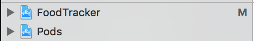
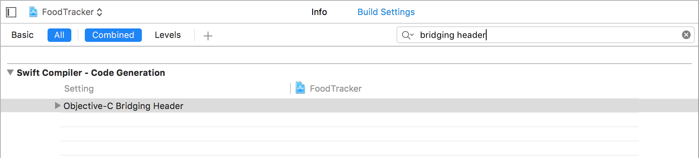
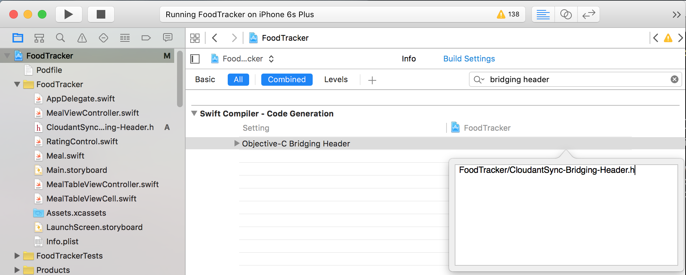
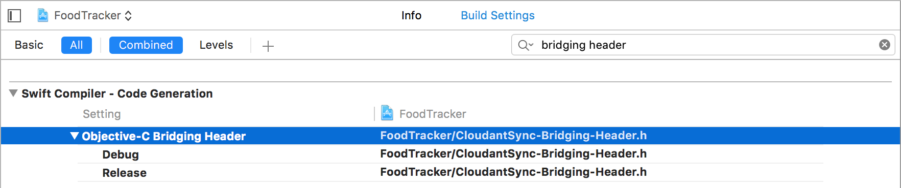

# Start Developing iOS Apps (Swift) - With Cloud Data Sync

This walkthrough is a "sequel" to Apple's well-known iOS programming introduction, [Start Developing iOS Apps (Swift)][apple-doc]. Apple's introduction walks us through the process of building the UI, data, and logic of an example food tracker app, culiminating with a section on data persistence: storing the app data as files in the iOS device.

This document picks up where that document leaves off: syncing data between devices, through the cloud, with an offline-first design. You will achieve this using open source tools and the IBM Cloudant service.

## About the Lessons

These lessons assume that you have completed the [FoodTracker app][apple-doc] from Apple's walkthrough. Begin with the completed sample project from the final lesson: [Persist Data][apple-doc-download].


## CocoaPods

The first step is to connect with the broader open source iOS software community by installing free software packages using [CocoaPods][cocoapods]. You will use the CocoaPods repository to integrate the [Cloudant Sync Datastore][cdtdatastore-pod] library.

### Learning Objectives

At the end of the lesson, you’ll be able to:

  1. Install CocoaPods on your Mac
  1. Use CocoaPods to download and integrate CDTDatastore with FoodTracker
  1. Build a bridging header to compile CDTDatastore into FoodTracker

### Install CocoaPods on your Mac

The CocoaPods web site has an excellent page, [Getting Started][cocoapods-getting-started], which covers intalling and upgrading. For your purposes, you will use the most simple, using the command-line `gem` program.

**To install CocoaPods**

  1. Open the Terminal application
    1. Click the Spotlight icon (a magnifying glass) in the Mac OS taskbar
    1. Type "terminal" in the Spotlight prompt, and press return
  1. In Terminal, type this command:

  ```
  sudo gem install cocoapods
  ```

  1. Confirm that CocoaPods is installed with this command:

  ```
  pod --version
  ```

  You should see the CocoaPods version displayed in Terminal:

  ```
  0.39.0
  ```

### Install CDTDatastore using CocoaPods

To install CDTDatastore as a dependency, create a *Podfile*, a simple configuration files which tell CocoaPods which packages this project needs.

**To create a Podfile**

  1. Choose File > New > File (or press Command-N)
  1. On the left side of the dialog that appears, select Other under iOS.
  1. Select Empty, and click Next.
  1. In the Save As field, type `Podfile`.
  1. The save location defaults to your project directory.

     The Group option defaults to your app name, FoodTracker.

     In the Targets section, make sure both your app and the tests for your app are not selected.
  1. Click Create.

     Xcode creates a file called `Podfile`.

Next, configure CDTDatastore in the Podfile.

**To configure the Podfile**

  1. Open `Podfile`.
  1. Add the following code

     ``` ruby
     platform :ios, '9.1'
     pod "CDTDatastore", '~> 1.0.0'
     ```
  1. Choose File > Save (or press Command-N)

With your Podfile in place, simply run the CocoaPods command in Terminal to install the CDTDatastore pod.

**To install CDTDatastore**

  1. Open Terminal
  1. Change to your project directory, the directory containing your new Podfile. For example,

     ```
     cd "FoodTracker - Cloud Data Sync" # Your 'cd' command may be different; change to the folder you use.
     ```
  1. Type this command

     ```
     pod install
     ```

You will see colorful output from CocoaPods in the terminal.

### Change from a Project to a Workspace

Because you are now integrating FoodTracker with the third-party CDTDatastore library, your project is really a *group* of projects combined into one useful whole. XCode supports this, and CocoaPods has already prepared you for this transition by creating `FoodTracker.xcworkspace` for you&mdash;a *workspace* encompassing both FoodTracker and CDTDatastore.

**To change to your project workspace**

  1. Choose File > Close Window (or press Command-W)
  1. Choose File > Open (or press Command-O)
  1. Select `FoodTracker.xcworkspace` and click Open

You will see a similar XCode view as before, but notice that you now have two projects now.

-

Test that everything still works by running your project again (Command-R). It should behave exactly as before; so you know that everything is in its place and working correctly.

## Compile with CDTDatastore

Your next step is to compile the Food Tracker along with CDTDatastore. You will not change any major FoodTracker code yet; however, this will confirm that CDTDatastore and FoodTracker integrate and compile correctly.

### Create the CDTDatastore Bridging Header

CDTDatastore is written in Objective-C. Your FoodTracker is a Swift project. Currently, the best way to integrate these projects together is with a [bridging header][bridging-header]. The bridging header, `CloudantSync-Bridging-Header.h` will tell Xcode to compile CDTDatastore into the final app. ("CloudantSync" is the name of the IBM Cloudant sync service, `CDTDatastore` is its iOS implementation.)

**To create a header file**

  1. Choose File > New > File (or press Command-N)
  1. On the left side of the dialog that appears, select Source under iOS.
  1. Select Header File, and click Next.
  1. In the Save As field, type `CloudantSync-Bridging-Header`.
  1. The save location defaults to your project directory.

     The Group option defaults to your app name, FoodTracker.

  1. In the Targets section, check the FoodTracker target.
  1. Click Create.

     Xcode creates and opens a file called `CloudantSync-Bridging-Header.h`.
  1. Under the line which says `#define CloudantSync_Bridging_Header_h`, insert the following code:

     ``` c
     #import <CloudantSync.h>
     ```

The header file contents are done. But, despite its name, this file is not yet a *bridging header* as far as Xcode cares. The final step is to tell Xcode that this file will serve as the Objective-C bridging header.

**To specify a project bridging header**

  1. Enter the Project Navigator view by clicking the upper-left folder icon (or press Command-1).
  1. Select the FoodTracker project
  1. Currently, only basic build settings are displayed; click All to show all build settings
  1. In the search bar, type "bridging header." You should see **Swift Compiler - Code Generation** and inside it, **Objective-C Bridging Header**.

     
  1. Double-click the empty space in the right column, in the row **Objective-C Bridging Header** (i.e. neither **Debug** nor **Release**, but above them).
  1. A prompt window will pop up. Input the following:

     ```
     FoodTracker/CloudantSync-Bridging-Header.h
     ```
     
  1. Press return

Your bridging header is done! Xcode should look like this:



*Checkpoint:* Run your app. This will confirm that the code compiles and runs. While you have not changed any user-facing app code, you have begun the first step to Cloudant Sync by compiling CDTDatastore into your project.

## Store Data Locally with Cloudant Sync

With CDTDatastore compiled and working, the next step is to replace the NSCoder persistence system with CDTDatastore. Currently, in `MealTableViewController.swift`, during initialization, the encoded array of meals is loaded from local storage. When you add or change a meal, the entire `meals` array is encoded and stored on disk. You will replace that system with a document-based architecture&mdash;in other words, each meal will be one record in the Cloudant Sync datastore.

Keep in mind, this first step of using Cloudant Sync *does not use the Internet at all*. The first goal is simply to store app data locally. After that works correctly, you will add cloud sync features. This is the *offline-first* architecture, with Internet access being *optional* to use the app. All data operations are on the local device. (If the device has an Internet connection, then the app will sync its data to the cloud&mdash;covered in the next section.)

### Remove NSCoding

Begin cleanly by removing the current NSCoding system from the model and the table view controller.

**To remove NSCoding from the model**

  1. Open `Meal.swift`
  1. Find the class declaration, which says:

     ``` swift
     class Meal: NSObject, NSCoding {
     ```
  1. Remove the word `NSCoding` and also the comma before it, making the new class declaration look like this:

     ``` swift
     class Meal: NSObject {
     ```
  1. Delete the comment line, `// MARK: NSCoding`.
  1. Delete the method below that, `encodeWithCoder(_:)`.
  1. Delete the method below that, `init?(coder aDecoder: NSCoder)`.

Next, remove NSCoding from the table view controller.

**To remove NSCoding from the table view controller**

  1. Open `MealTableViewController.swift`
  1. Find the method `viewDidLoad()`, and delete the comment `// Load any saved meals`... and also the if/else code below it:

     ``` swift
     // Load any saved meals, otherwise load sample data.
     if let savedMeals = loadMeals() {
         meals += savedMeals
     } else {
         // Load the sample data.
         loadSampleMeals()
     }
     ```
  1. Find the method `tableView(_:commitEditingStyle:forRowAtIndexPath:)` and delete the line of code `saveMeals()`.
  1. Find the method `unwindToMealList(_:) and delete its last two lines of code: a comment, and a call to `saveMeals()`.

     ``` swift
     // Save the meals.
     saveMeals()
     ```
  1. Delete the comment line, `// MARK: NSCoding`
  1. Delete the function below that, `func saveMeals()`.
  1. Delete the function below that, `func loadMeals()`.

*Checkpoint:* Run your app. The app will obviously lose some functionality: loading stored meals, and creating the first three sample meals; although you can still create, edit, and remove meals (but they will not persist if you quit the app). That is okay. In the next step, you will restore these functions using Cloudant Sync instead.

### Initialize the Cloudant Sync Datastore

Now you will add meal loading, saving, and initializing functionality back to the app, using the Cloudant Sync datastore. One consideration is that if you delete a sample meal, you do not want it to be re-created the next time you run the app. To support this requirement, you will use *document conflicts* to do nothing if the meal had already been initialized.

This will be the basic design:

  * Each meal is a single document, which will contain the meal name, its rating, and a photo attachment.
  * To initialize the first three meals, simply attempt to create their documents.
    * If the meals are not yet in the datastore, they will be created normally;
    * If the meals already exist, CDTDatastore will return a "conflict" result, which you will ignore. Even if you editing or deleting a sample meal, its existence (or its "tombstone") will still be in the datastore, so restarting the app will not accidentally re-create it.

**To initialize the datastore**

  1. Open `MealTableViewController.swift`
  1. In `MealTableViewController.swift`, find the `MARK: Properties` section, append the following code beneath the line `var meals = [Meal]()`:

     ``` swift
     var datastoreManager: CDTDatastoreManager?
     var datastore: CDTDatastore?
     ```
  1. In `MealTableViewController.swift`, append the following code to the method `viewDidLoad()`:

     ``` swift
     // Initialize the Cloudant Sync local datastore.
     let fileManager = NSFileManager.defaultManager()

     let documentsDir = fileManager.URLsForDirectory(.DocumentDirectory,
         inDomains: .UserDomainMask).last!

     let storeURL = documentsDir.URLByAppendingPathComponent("foodtracker-data")
     let path = storeURL.path

     do {
         datastoreManager = try CDTDatastoreManager(directory: path)
         datastore = try datastoreManager!.datastoreNamed("meals")
     } catch {
         print("Error initializing datastore: \(error)")
         return
     }
     ```

## Sync with IBM Cloudant

[apple-doc]: https://developer.apple.com/library/prerelease/ios/referencelibrary/GettingStarted/DevelopiOSAppsSwift/index.html
[apple-doc-download]: https://developer.apple.com/library/prerelease/ios/referencelibrary/GettingStarted/DevelopiOSAppsSwift/Lesson10.html#//apple_ref/doc/uid/TP40015214-CH14-SW3
[bridging-header]: https://developer.apple.com/library/ios/documentation/Swift/Conceptual/BuildingCocoaApps/MixandMatch.html
[cdtdatastore-pod]: https://cocoapods.org/pods/CDTDatastore
[cocoapods]: https://cocoapods.org/
[cocoapods-getting-started]: https://guides.cocoapods.org/using/getting-started.html
