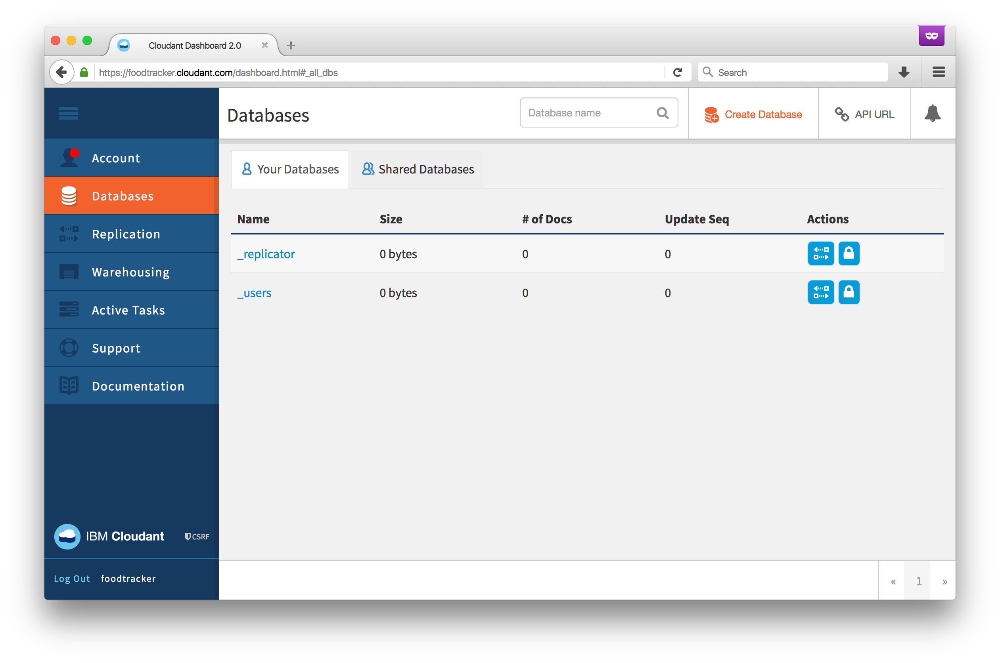

# Start Developing iOS Apps (Swift) with Cloud Sync; Part 2: Sync to Cloudant

This walkthrough is a sequel to Apple's well-known iOS programming introduction, [Start Developing iOS Apps (Swift)][apple-doc]. Apple's introduction walks us through the process of building the UI, data, and logic of an example food tracker app, culiminating with a section on data persistence: storing the app data as files in the iOS device.

This series picks up where that document leaves off: syncing data between devices, through the cloud, with an offline-first design. You will achieve this using open source tools and the IBM Cloudant service.

This document is the second in the series, showing you how to sync the app data to Cloudant. You can also review the previous post in the series, [Part 1: The Datastore][part-1].

## Outline

**This will be removed before publishing**

* Getting Started with FoodTracker
* Getting Started with IBM Cloudant
  * Create a Free IBM Cloudant Account
  * Create a database for meals
  * Give FoodTracker access to a database
    * Generate an API key
    * Set permissions
    * Confirm with curl -I, confirm status code, confirm body
* How to Start Over
  * How to delete iOS Simulator data
  * How to delete Cloudant data
* Push replication
  * The sync code
  * Set the user-agent
    * figure out how to explain why besides ("so we can track adoption")
    * Maybe because you can use this with CouchDB and you'll want to track it there.
  * Sync when samples are created
  * Confirm in dashboard: run the app and look for changes
  * Sync when the user makes a change
  * Confirm in dashboard
* Pull replication
  * New code: update the sync to support pull
  * Activate pull sync when the app starts
  * Confirm
    * Change a rating in the dashboard
    * Start the app
    * Note the star change
* Next steps: UI integration
  * Visual feedback of pushing
  * Pull to refresh
  * Be vague since I'm less clear what the scope is

## Getting Started with FoodTracker

If you have been following along, you will continue with your FoodTracker project. Or, you can download

This document assumes that you have completed [Part 1: The Datastore][part-1] of the series. If you have completed that walkthrough, you may continue with your FoodTracker project.

Alternatively, you can download the prepared project from the [Part 1 Code download][part-1-download] and begin there. Extract the zip file, `FoodTracker-Cloudant-Sync-1.zip`, browse into its folder with Finder, and double-click `FoodTracker.xcworkspace`. That will open the project in Xcode. Run the app (Command-R) and confirm that it works correctly. If everything is in order, proceed with these instructions.

## Getting Started with Cloudant

### Create a Free IBM Cloudant Account

Getting started with IBM Cloudant is free and easy.

### XXX

## Conclusion

Congratulations! XXX Explain what has been accomplished

XXX Tease the next section

## Download This Project

To see the completed sample project for this lesson, download the file and view it in Xcode.

[Download File][code-download]

## XXX Unresolved To-Dos

Is there any good or official documentation about using the dashboard?

Set user-agent

Crop the stupid drop shadow on the screenshots

Do we want to make a design doc for the shared project where people can create images? We could probably reuse that work in a future chapter about security

[END]: ------------------------------------------------

[part-1]: https://developer.ibm.com/clouddataservices/2016/01/25/start-developing-ios-apps-swift-with-cloud-sync-part-1-the-datastore/
[part-1-download]: https://developer.ibm.com/clouddataservices/2016/01/25/start-developing-ios-apps-swift-with-cloud-sync-part-1-the-datastore/#download-this-project
[apple-doc]: https://developer.apple.com/library/prerelease/ios/referencelibrary/GettingStarted/DevelopiOSAppsSwift/index.html
[code-download]: media/FoodTracker-Cloudant-Sync-2.zip
