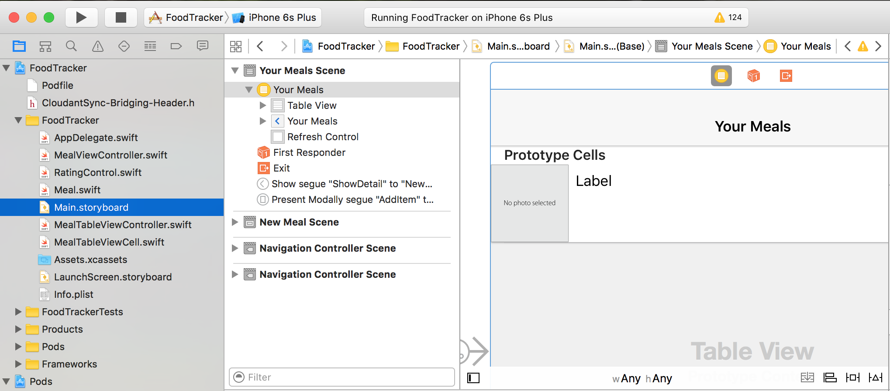
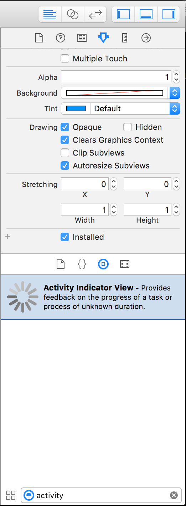
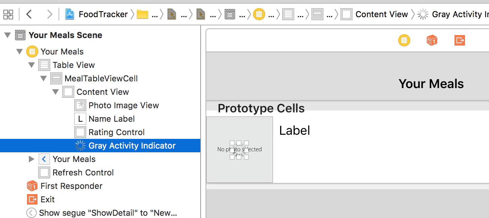

# Offline-First iOS Apps with Swift & Cloudant Sync; Part 3: User Interface

This walkthrough is a sequel to Apple's well-known iOS programming introduction, [Start Developing iOS Apps (Swift)][apple-doc]. Apple's introduction walks us through the process of building the UI, data, and logic of an example food tracker app, culiminating with a section on data persistence: storing the app data as files in the iOS device.

This series picks up where that document leaves off: syncing data between devices, through the cloud, with an offline-first design. You will achieve this using the free IBM Cloudant service, with open source tools.

This document is the third in the series, covering useful user interface features related to Cloudant Sync. You can also review the previous post in the series:

1. [Part 1: The Datastore][part-1].
1. [Part 2: Sync to the Cloud][part-2].

## Getting Started with FoodTracker


This document assumes that you have completed [Part 2: The Datastore][part-2] of the series. If you have completed that walkthrough, you may continue with your FoodTracker project.

Alternatively, you can download the prepared project from the [Part 2 Code download][part-2-download] and begin there. Extract the zip file, `FoodTracker-Cloudant-Sync-2.zip`, browse into its folder with Finder, and double-click `FoodTracker.xcworkspace`. That will open the project in Xcode.

## Configure for Your Cloudant Account

If you downloaded the FoodTracker source code from the link above, then you must re-configure it to work with your own IBM Cloudant account. For a simple example like FoodTracker, these credentials are simply hard-coded in the source code. If you want to generate a new API key for your app, see the section in [Part 2, Prepare Cloudant for the Food Tracker App][part-2-prep].

1. Open `MealTableViewController.swift`
1. In `MealTableViewController.swift`, find the section, `MARK: Cloudant Settings`
1. Find the comment: `// NOTE: You must change these values for your own application.`
1. Modify the three values below that comment. For example:

  ``` swift
  // NOTE: You must change these values for your own application.
  let cloudantAccount = "my-name"
  let cloudantApiKey = "andougstonlyingeoledteat"
  let cloudantApiPassword = "995f34498cb918334c7f0b962b8e973ced13003d"
  ```

Checkpoint: **Run your app.** As always do not worry about compiler warnings from third-party, open source libraries.

In the console log, you should see messages indicating a successful pull replication. If everything is in order, proceed with these instructions. If you have a problem with compilation or replication, compare your code carefully to the code from [part 2][part-2].

If you download the prepared project, when you first open it with Xcode, you may see warnings about *CDTDatastore* and related names. This will go away on its own once Xcode has indexed the project. **Wait for Xcode to index** the project. Then, **run a build (Command-B)**. When that completes, you will know that everything is working correctly.

## The Problem: No Transparency for Users

Suppose a user creates a new meal. Presumably, they are aware of Food Tracker's cloud sync capabilities. Indeed, that is a major selling point!

Unfortunately, the user will now expect some sort of feedback to tell them when the meal is "saved," or "synced." They know that data takes some time to transfer to the cloud. They know that somtimes the network is fast; sometimes it is slow.

Now suppose the user knows that new meals are already synced in the cloud (for example, they have created meals on a different iOS device). They know that an update is "due" but they have no way to tell Food Tracker, "Hey! Sync from the cloud now. New data awaits!"

If Food Tracker just quietly accepts new meals, and also vaguely promises to sync to and from the cloud, but there is no transparency for the user to see what is going on, then the user will be disappointed. As you use mobile and web apps for yourself, notice the abundance of subtle feedback cues, often telling you when syncing is in-process (usually a spinning spinner), and when it's been completed (the spinner goes away, or a green check appears, etc.)

## The "Pushing" Spinner

Start by showing the user when a push is underway. When the user adds or changes a meal, you should superimpose a "spinner" on top of the meal thumbnail. This lets them know that their change is in-flight, destined for permanance in the cloud, somewhere.

When the push completes, simply remove the spinner, and the user will know: Push complete! Start in the storyboard, with the spinner.

**To create the activity indicator**

1. Open `Main.storyboard`
1. Look in the tree navigation panel, on the left. Click **Your Meals Scene** and position the display so that you can see the photo in the prototype cell.

  

1. Make sure that the Utilities panel is visible (the rightmost panel). Click the Object Library, and in the filter prompt, type *activity*. This will reveal the Activity Indicator View object.

  

1. Drag the Activity Indicator View and position it centered over the meal photo.

  

1. With the new Activity Indicator View selected, select the Attributes Inspector in the utilities panel.
1. Set **Style** to *Large White*.
1. Set **Color** to *Light Gray Color*.
1. For Behavior, check *Hides When Stopped*.
1. Rename the indicator in the tree view of your scene. Renaming works the same as the Mac OS Finder: With the indicator already highlighted, click it once. A prompt will pop up, and enter, *Sync Indicator*

The final step is to make an outlet, so that this sync indicator is declared in the `MealTableViewCell` class.

**To create an outlet for the sync indicator**

1. With `Main.storyboard` still open, show the assistant editor (the icon of two linked circles). Now, you have one editor with your storyboard, and another with Swift source code.
1. In the source code editor, select `MealTableViewCell.swift`. You should now see that file's contents in the editor.
1. Back in the storyboard, right-click **Sync Indicator**. A window for outlets will pop up.
1. Find the row "New Referencing Outlet" and drag and drop: from the circle (it will become a plus sign when you mouse over), over to the `MealTableViewCell.swift` source code, where the existing variables are declared.
1. A prompt will pop up, asking for information about this connection. Under **Name**, enter *syncIndicator* and then click Connect.

You may switch back to the Standard Editor if you like. Looking at `MealTableViewCell.swift`, you will see a new property declared: `@IBOutlet weak var syncIndicator: UIActivityIndicatorView!`

Great! Now you can reference a cell's `.syncIndicator` property. All that remains is to activate it when push replication begins, and to stop it when replication completes.

**To use the sync indicator**

1. Open `MealTableViewController.swift`
1. In `MealTableViewController.swift`, find the method, `unwindToMealList(_:)`.
1. Notice that the method is mostly one if/else branch, the "if" block handling meal updates, and the "else" handling new meal creation.
1. In the "if" block, after the call to `updateMeal(meal)`, insert these lines:

  ``` swift
  // Mark the meal in-flight. When sync completes, the
  // indicator will stop.
  let cell = tableView.cellForRowAtIndexPath(selectedIndexPath)
      as! MealTableViewCell
  cell.syncIndicator.startAnimating()
  ```
1. In the "else" block, after the call to `createMeal(meal)`, insert these lines:

  ``` swift
  // Mark the meal in-flight. When sync completes, the
  // indicator will stop.
  let cell = tableView.cellForRowAtIndexPath(selectedIndexPath)
      as! MealTableViewCell
  cell.syncIndicator.startAnimating()
  ```

To double-check, your complete `unwindToMealList(_:)` method will look like this:

``` swift
@IBAction func unwindToMealList(sender: UIStoryboardSegue) {
    if let sourceViewController = sender.sourceViewController as? MealViewController, meal = sourceViewController.meal {
        if let selectedIndexPath = tableView.indexPathForSelectedRow {
            // Update an existing meal.
            meals[selectedIndexPath.row] = meal
            tableView.reloadRowsAtIndexPaths([selectedIndexPath], withRowAnimation: .None)
            updateMeal(meal)
            
            // Mark the meal in-flight. When sync completes, the
            // indicator will stop.
            let cell = tableView.cellForRowAtIndexPath(selectedIndexPath)
                as! MealTableViewCell
            cell.syncIndicator.startAnimating()
        } else {
            // Add a new meal.
            let newIndexPath = NSIndexPath(forRow: meals.count, inSection: 0)
            meals.append(meal)
            tableView.insertRowsAtIndexPaths([newIndexPath], withRowAnimation: .Bottom)
            createMeal(meal)
            
            // Mark the meal in-flight. When sync completes, the
            // indicator will stop.
            let cell = tableView.cellForRowAtIndexPath(newIndexPath)
                as! MealTableViewCell
            cell.syncIndicator.startAnimating()
        }
        
        sync(.Push)
    }
}
```

The final step is to stop the spinners when replication completes.

**To stop the activity indicator when replication completes**

1. In `MealTableViewController.swift`, find the method, `replicatorDidComplete(_:)`.
1. Notice that the method is mostly one "if" block, handing a completed pull replication.
1. Immediately after the "if" block, append an "else if" block, to handle a completed push replication:

  ``` swift
  } else if (replicator == replications[.Push]) {
      // Stop all active spinners. Note, this does not perfectly
      // reflect the real replication state; however, it is very
      // simple, and it typically works well enough.
      dispatch_async(dispatch_get_main_queue(), {
          for cell in self.tableView.visibleCells
              as! [MealTableViewCell] {
                  cell.syncIndicator.stopAnimating()
          }
      })
  }
  ```

Checkpoint: **Run your app.** Change a meal rating. Create a new meal. Notice the spinner superimposed on your meal image. If you watch the app log in Xcode, you can confirm that, when replication completes, the spinners stop and become invisible again.

In a more full-featured app, of course you will want to handle other situations in a more clever way. What if the phone is in airplane mode? What if the cellular bandwidth is very slow, causing the replication to fail? What about when service is restored and everything finally syncs with Cloudant? For a mature, full-featured app, you will want to add different behaviors for all of these situations. (But of course, Food Tracker is an app for learning.)

## Pull to Refresh

Pull-to-refresh is a great feature to give users visibility and control of the incoming pull replication process. With pull-to-refresh, the user drags their finger downward, indicating their desire to retrieve updates from the cloud. This is a perfect place to trigger a pull replication!

Begin by enabling refreshing in the storyboard.

1. Open `Main.storyboard`
1. Look in the tree navigation panel, on the left. **Click the "Your Meals" view controller**, which has the yellow icon.

  

  You will also see that the view controller is selected in the storyboard.

  
  
1. In the Utilities (the rightmost panel in Xcode), be sure that you have selected the Attributes inspector. Visually scan down the attributes until you find the **Table View Controller** section.
1. In the **Table View Controller** section, **set the Refreshing attribute to Enabled**.

  

When complete, Xcode should look like this.


Next, implement the "refresh" function. It is very simple: just trigger pull replication.

1. In `MealTableViewController.swift`, find the section, `MARK: Cloudant Sync`
1. In the section `MARK: Cloudant Sync`, insert this function just above `cloudURL()`

  ``` swift
  func handleRefresh(refreshControl: UIRefreshControl) {
      print("Pull to refresh!")
      sync(.Pull)
  }
  ```

Of course, when the replication completes, the UI should reflect that. All you need to do is to stop the refresh control when a pull replication completes. (If the refresh control was not active, then nothing will happen, which is harmless.)

1. In `MealTableViewController.swift`, find the section, `MARK: Cloudant Sync`
1. Go to the function, `replicatorDidComplete(_:)`
1. In the code block for pull replications, append the code to end the refresh control. The `if` block in the middle of the function should now look like this:

  ``` swift
  if (replicator == replications[.Pull]) {
     if (replicator.changesProcessed > 0) {
         // Reload the meals, and refresh the UI.
         loadMealsFromDatastore()
         dispatch_async(dispatch_get_main_queue(), {
             self.tableView.reloadData()
         })
     }

     // End the refresh spinner, if necessary.
     self.refreshControl?.endRefreshing()
  }
  ```

The final step is to connect the UI refresh control to this code.

1. In `MealTableViewController.swift`, find the section, `MARK: Cloudant Settings`
1. Go to the function, `viewDidLoad()`
1. Add the following code, so that the beginning of the function looks like so:

  ``` swift
  super.viewDidLoad()
  
  // Activate the pull-to-refresh control.
  self.refreshControl = UIRefreshControl()
  self.refreshControl?.addTarget(self, action:
      #selector(MealTableViewController.handleRefresh(_:)),
      forControlEvents: UIControlEvents.ValueChanged)
  ```

Checkpoint: **Run your app.** As always do not worry about compiler warnings from third-party, open source libraries.

## Conclusion

Congratulations! Today's accomplishment is so delightful! Your users will appreciate these clear, tangible features: sync status spinners and pull-to-refresh. Although part 2 of this series lays the foundation for syncing, Food Tracker simply wasn't much fun to use without visual feedback and tactile control.

This concludes the major parts of this series. If you have followed along, then you have created an iOS app in Swift, using the local data store, `CDTDatastore`. You connected that datastore to IBM Cloudant, with bi-directional replication to and from Cloudant. Finally, you added user interface features to let users interact with these capabilities.

[END]: ------------------------------------------------

[apple-doc]: https://developer.apple.com/library/prerelease/ios/referencelibrary/GettingStarted/DevelopiOSAppsSwift/index.html
[code-download]: media/FoodTracker-Cloudant-Sync-3.zip
[part-1]: https://developer.ibm.com/clouddataservices/2016/01/25/start-developing-ios-apps-swift-with-cloud-sync-part-1-the-datastore/
[part-2]: http://developer.ibm.com/clouddataservices/?p=5451
[part-2-download]: https://developer.ibm.com/clouddataservices/2016/06/08/offline-first-ios-apps-part-2-cloud-sync/#download-this-project
[part-2-prep]: https://developer.ibm.com/clouddataservices/2016/06/08/offline-first-ios-apps-part-2-cloud-sync/#prepare-cloudant-for-the-foodtracker-app
